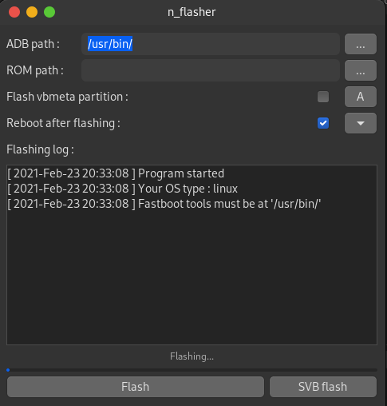

# n_flasher

## Description
---

n_flasher is a powerfull application for Nokia 7.1 flashing written on D and GTK+ (GTKd)




---


## Linux build

### Arch dependencies install
```bash
    sudo pacman -S dlang meson ninja gtkd
```

### Ubuntu dependencies install
```bash
    sudo apt install libgtkd-3-dev meson ninja-build ldc
```

### Build process
```bash
    git clone https://github.com/KonstantIMP/n_flasher.git

    cd n_flasher

    meson builddir
    ninja -C builddir

    #For run programm
    ./builddir/n_flasher
```

## Windows install
Download latest release archive and unpack its

Install nokia 7.1 driver from driver directory

Run n_flasher.exe